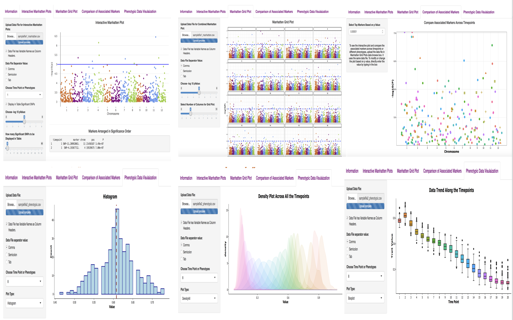

 # ShinyAIM


The application is hosted on Shinyapps.io here: https://chikudaisei.shinyapps.io/shinyaim/

The application can be run  locally with just one command in R software or RStudio:</p>
```
shiny::runGitHub("ShinyAIM", "whussain2")
```
Make sure the required libraries including "shiny", "ggplot2", "dplyr", "grid", "plotly", "manhattanly", "forcats" are installed and laoded before running the above command.
These packages can be installed by running the following code in R or RStudio:
```
install.packages(c("shiny","ggplot2","dplyr","grid","plotly","manhattanly","forcats"))
```
# Licensing
This shiny code is licensed under Artistic License 2.0. at https://opensource.org/licenses/Artistic-2.0. 
Copyright (c) 2018, Waseem Hussain,  code licensed under Artistic License 2.0.
# Contact
You may contact the author of this code, Waseem hussain at <waseem.hussain@ul.edu>
# DOI
[](https://doi.org/10.5281/zenodo.1419296)
